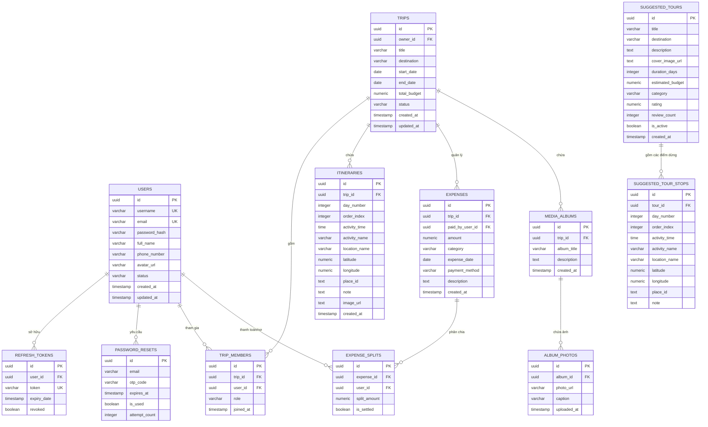
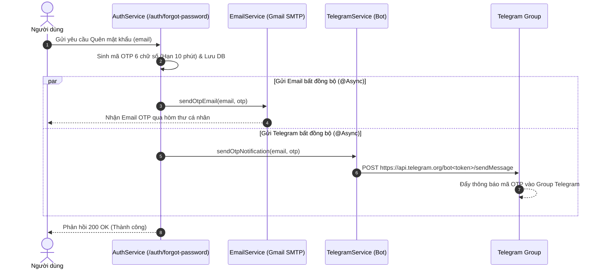

# 🗺️ MyTravel RESTful API System Documentation (v2.0 - Extended & Production Ready)

> **Version:** 2.0.0  
> **Base URL:** `https://api.mytravel.com/api/v1` (Local Server: `http://localhost:8080/api/v1`)  
> **Format:** JSON (`Content-Type: application/json`)  
> **Authentication:** Bearer Token JWT (`Authorization: Bearer <token>`)

---

## 🏗️ 1. Thiết Kế Cơ Sở Dữ Liệu (Database Schema DDL)

### 1.1 Sơ Đồ Quan Hệ Thực Thể (ERD - Entity Relationship Diagram)



---

### 1.2 PostgreSQL DDL Script

```sql
-- =============================================================
-- MYTRAVEL DATABASE SCHEMA DDL (POSTGRESQL - UUID PRIMARY KEYS)
-- =============================================================

CREATE EXTENSION IF NOT EXISTS "uuid-ossp";

-- 1. USERS TABLE
CREATE TABLE IF NOT EXISTS users (
    id UUID PRIMARY KEY DEFAULT gen_random_uuid(),
    username VARCHAR(50) NOT NULL UNIQUE,
    email VARCHAR(100) NOT NULL UNIQUE,
    password_hash VARCHAR(255) NOT NULL,
    full_name VARCHAR(100),
    phone_number VARCHAR(20),
    avatar_url TEXT,
    status VARCHAR(20) NOT NULL DEFAULT 'ACTIVE',
    created_at TIMESTAMP WITH TIME ZONE DEFAULT CURRENT_TIMESTAMP,
    updated_at TIMESTAMP WITH TIME ZONE DEFAULT CURRENT_TIMESTAMP
);

CREATE INDEX IF NOT EXISTS idx_users_email ON users(email);
CREATE INDEX IF NOT EXISTS idx_users_username ON users(username);

-- 2. REFRESH TOKENS TABLE (Hỗ trợ JWT Rotation)
CREATE TABLE IF NOT EXISTS refresh_tokens (
    id UUID PRIMARY KEY DEFAULT gen_random_uuid(),
    user_id UUID NOT NULL REFERENCES users(id) ON DELETE CASCADE,
    token VARCHAR(255) NOT NULL UNIQUE,
    expiry_date TIMESTAMP WITH TIME ZONE NOT NULL,
    revoked BOOLEAN NOT NULL DEFAULT FALSE,
    created_at TIMESTAMP WITH TIME ZONE DEFAULT CURRENT_TIMESTAMP
);

CREATE INDEX IF NOT EXISTS idx_refresh_tokens_token ON refresh_tokens(token);

-- 3. PASSWORD RESETS TABLE (Quản lý mã OTP khôi phục mật khẩu)
CREATE TABLE IF NOT EXISTS password_resets (
    id UUID PRIMARY KEY DEFAULT gen_random_uuid(),
    email VARCHAR(100) NOT NULL,
    otp_code VARCHAR(6) NOT NULL,
    expires_at TIMESTAMP WITH TIME ZONE NOT NULL,
    is_used BOOLEAN NOT NULL DEFAULT FALSE,
    attempt_count INT NOT NULL DEFAULT 0,
    created_at TIMESTAMP WITH TIME ZONE DEFAULT CURRENT_TIMESTAMP
);

CREATE INDEX IF NOT EXISTS idx_password_resets_email_otp ON password_resets(email, otp_code);

-- 4. TRIPS TABLE
CREATE TABLE IF NOT EXISTS trips (
    id UUID PRIMARY KEY DEFAULT gen_random_uuid(),
    owner_id UUID NOT NULL REFERENCES users(id) ON DELETE CASCADE,
    title VARCHAR(150) NOT NULL,
    destination VARCHAR(150) NOT NULL,
    start_date DATE NOT NULL,
    end_date DATE NOT NULL,
    total_budget NUMERIC(15, 2) DEFAULT 0.00,
    status VARCHAR(20) NOT NULL DEFAULT 'PLANNED',
    created_at TIMESTAMP WITH TIME ZONE DEFAULT CURRENT_TIMESTAMP,
    updated_at TIMESTAMP WITH TIME ZONE DEFAULT CURRENT_TIMESTAMP,
    CONSTRAINT chk_trip_dates CHECK (end_date >= start_date)
);

CREATE INDEX IF NOT EXISTS idx_trips_owner ON trips(owner_id);
CREATE INDEX IF NOT EXISTS idx_trips_dates ON trips(start_date, end_date);

-- 5. TRIP MEMBERS TABLE (Thành viên chuyến đi / Đi nhóm)
CREATE TABLE IF NOT EXISTS trip_members (
    id UUID PRIMARY KEY DEFAULT gen_random_uuid(),
    trip_id UUID NOT NULL REFERENCES trips(id) ON DELETE CASCADE,
    user_id UUID NOT NULL REFERENCES users(id) ON DELETE CASCADE,
    role VARCHAR(20) NOT NULL DEFAULT 'MEMBER', -- OWNER, EDITOR, VIEWER
    joined_at TIMESTAMP WITH TIME ZONE DEFAULT CURRENT_TIMESTAMP,
    CONSTRAINT uk_trip_user UNIQUE (trip_id, user_id)
);

-- 6. ITINERARIES TABLE (Lịch trình theo ngày & thứ tự)
CREATE TABLE IF NOT EXISTS itineraries (
    id UUID PRIMARY KEY DEFAULT gen_random_uuid(),
    trip_id UUID NOT NULL REFERENCES trips(id) ON DELETE CASCADE,
    day_number INT NOT NULL CHECK (day_number > 0),
    order_index INT NOT NULL DEFAULT 0,
    activity_time TIME WITHOUT TIME ZONE,
    activity_name VARCHAR(200) NOT NULL,
    location_name VARCHAR(255),
    latitude NUMERIC(10, 8),
    longitude NUMERIC(11, 8),
    place_id TEXT,
    note TEXT,
    image_url TEXT,
    created_at TIMESTAMP WITH TIME ZONE DEFAULT CURRENT_TIMESTAMP
);

CREATE INDEX IF NOT EXISTS idx_itineraries_trip_day ON itineraries(trip_id, day_number);

-- 7. EXPENSES TABLE (Khoản chi tiêu)
CREATE TABLE IF NOT EXISTS expenses (
    id UUID PRIMARY KEY DEFAULT gen_random_uuid(),
    trip_id UUID NOT NULL REFERENCES trips(id) ON DELETE CASCADE,
    paid_by_user_id UUID NOT NULL REFERENCES users(id) ON DELETE CASCADE,
    amount NUMERIC(15, 2) NOT NULL CHECK (amount > 0),
    category VARCHAR(50) NOT NULL, -- FOOD, TRANSPORT, ACCOMMODATION, TICKET, SHOPPING, OTHER
    expense_date DATE NOT NULL,
    payment_method VARCHAR(50) DEFAULT 'CASH', -- CASH, CARD, E_WALLET, BANK_TRANSFER
    description TEXT,
    created_at TIMESTAMP WITH TIME ZONE DEFAULT CURRENT_TIMESTAMP
);

CREATE INDEX IF NOT EXISTS idx_expenses_trip ON expenses(trip_id);

-- 8. EXPENSE SPLITS TABLE (Chia tiền giữa các thành viên)
CREATE TABLE IF NOT EXISTS expense_splits (
    id UUID PRIMARY KEY DEFAULT gen_random_uuid(),
    expense_id UUID NOT NULL REFERENCES expenses(id) ON DELETE CASCADE,
    user_id UUID NOT NULL REFERENCES users(id) ON DELETE CASCADE,
    split_amount NUMERIC(15, 2) NOT NULL CHECK (split_amount >= 0),
    is_settled BOOLEAN NOT NULL DEFAULT FALSE,
    CONSTRAINT uk_expense_user UNIQUE (expense_id, user_id)
);

-- 9. MEDIA ALBUMS TABLE (Album kỷ niệm)
CREATE TABLE IF NOT EXISTS media_albums (
    id UUID PRIMARY KEY DEFAULT gen_random_uuid(),
    trip_id UUID NOT NULL REFERENCES trips(id) ON DELETE CASCADE,
    album_title VARCHAR(150) NOT NULL,
    description TEXT,
    created_at TIMESTAMP WITH TIME ZONE DEFAULT CURRENT_TIMESTAMP
);

-- 10. ALBUM PHOTOS TABLE (Ảnh trong album)
CREATE TABLE IF NOT EXISTS album_photos (
    id UUID PRIMARY KEY DEFAULT gen_random_uuid(),
    album_id UUID NOT NULL REFERENCES media_albums(id) ON DELETE CASCADE,
    photo_url TEXT NOT NULL,
    caption VARCHAR(255),
    uploaded_at TIMESTAMP WITH TIME ZONE DEFAULT CURRENT_TIMESTAMP
);

CREATE INDEX IF NOT EXISTS idx_album_photos_album ON album_photos(album_id);

-- 11. SUGGESTED TOURS TABLE (Bảng lưu các Tour gợi ý / mẫu cho cộng đồng)
CREATE TABLE IF NOT EXISTS suggested_tours (
    id UUID PRIMARY KEY DEFAULT gen_random_uuid(),
    title VARCHAR(200) NOT NULL,
    destination VARCHAR(150) NOT NULL,
    description TEXT,
    cover_image_url TEXT,
    duration_days INT DEFAULT 1,
    estimated_budget NUMERIC(15, 2) DEFAULT 0.00,
    category VARCHAR(50) DEFAULT 'GENERAL',
    rating NUMERIC(3, 2) DEFAULT 5.00,
    review_count INT DEFAULT 0,
    is_active BOOLEAN NOT NULL DEFAULT TRUE,
    created_at TIMESTAMP WITH TIME ZONE DEFAULT CURRENT_TIMESTAMP
);

-- 12. SUGGESTED TOUR STOPS TABLE (Các điểm dừng / mốc thời gian trong Tour gợi ý)
CREATE TABLE IF NOT EXISTS suggested_tour_stops (
    id UUID PRIMARY KEY DEFAULT gen_random_uuid(),
    tour_id UUID NOT NULL REFERENCES suggested_tours(id) ON DELETE CASCADE,
    day_number INT NOT NULL CHECK (day_number > 0),
    order_index INT NOT NULL DEFAULT 0,
    activity_time TIME WITHOUT TIME ZONE,
    activity_name VARCHAR(200) NOT NULL,
    location_name VARCHAR(255),
    latitude NUMERIC(10, 8),
    longitude NUMERIC(11, 8),
    place_id TEXT,
    note TEXT
);

CREATE INDEX IF NOT EXISTS idx_suggested_tour_stops_tour ON suggested_tour_stops(tour_id, day_number);

```

---

## 📋 2. Quy Chuẩn Phản Hồi API (Common Standards)

### 2.1 Cấu Trúc Lỗi Chuẩn (Standard Error Response)
```json
{
  "timestamp": "2026-09-28T15:00:00Z",
  "status": 400,
  "error": "BAD_REQUEST",
  "message": "Dữ liệu đầu vào không hợp lệ",
  "errors": [
    {
      "field": "email",
      "message": "Email không đúng định dạng"
    }
  ],
  "path": "/api/v1/auth/register"
}
```

### 2.2 Quy Chuẩn Phân Trang (Pagination Standard Response)
Áp dụng cho các API trả về danh sách (`GET /trips`, `GET /trips/{id}/expenses`, v.v.):
`GET /api/v1/trips?page=0&size=10&sort=startDate,desc`
```json
{
  "content": [],
  "pageNumber": 0,
  "pageSize": 10,
  "totalElements": 25,
  "totalPages": 3,
  "last": false
}
```

---

## 📋 3. Danh Sách Phân Hệ API Hoàn Chỉnh

| Phân Hệ API | Base Path | Mô Tả Chức Năng |
| :--- | :--- | :--- |
| **Authentication** | `/auth` | Đăng nhập, Đăng ký, Refresh Token, Đăng xuất, Quên MK (Gửi OTP Email & Telegram Group), Đổi MK |
| **User Profile** | `/users` | Lấy thông tin cá nhân, Cập nhật Profile, Upload Avatar |
| **Trips (Chuyến Đi)** | `/trips` | Thêm/Sửa/Xóa Chuyến đi, Phân trang/Lọc, Quản lý thành viên đi cùng |
| **Itineraries (Lịch Trình)** | `/itineraries` | CRUD Mốc lịch trình theo ngày (Bổ sung `imageUrl` ảnh timeline), Re-order thứ tự mốc |
| **Expenses (Tài Chính)** | `/expenses` | CRUD Chi tiêu, Tổng hợp phân tích theo danh mục, Split tiền nhóm |
| **Media & Storage** | `/media` | Quản lý Album & Tải lên nhiều ảnh/video kỷ niệm |
| **Locations (Vị Trí & Maps)** | `/locations` | Tìm địa điểm, Lấy chi tiết & Reverse Geocoding (Tích hợp song song Vietmap v4 & Google Maps) |

---

## 🔑 4. Chi Tiết Các Endpoints API

### 4.1 Phân Hệ Xác Thực & Tài Khoản (`/auth`)

#### 4.1.1 Đăng Nhập
* **HTTP Method:** `POST` | **Endpoint:** `/auth/login`
* **Request Body:**
```json
{
  "username": "admin",
  "password": "Password123@"
}
```
* **Response `200 OK`:**
```json
{
  "accessToken": "eyJhbGciOiJIUzI1NiJ9...",
  "refreshToken": "7c9e6679-7425-40de-944b-e07fc1f90ae7",
  "tokenType": "Bearer",
  "expiresIn": 86400,
  "user": {
    "id": "a0eebc99-9c0b-4ef8-bb6d-6bb9bd380a11",
    "username": "admin",
    "email": "admin@travel.com",
    "fullName": "Bùi Ngọc Đại"
  }
}
```

#### 4.1.2 Đăng Ký Tài Khoản Mới
* **HTTP Method:** `POST` | **Endpoint:** `/auth/register`
* **Request Body:**
```json
{
  "username": "ngocdai",
  "email": "ngocdai@gmail.com",
  "password": "Password123@",
  "fullName": "Bùi Ngọc Đại",
  "phone": "0987654321"
}
```
* **Response `201 Created`:**
```json
{
  "message": "Đăng ký tài khoản thành công!",
  "status": 201
}
```

#### 4.1.3 Refresh Access Token
* **HTTP Method:** `POST` | **Endpoint:** `/auth/refresh-token`
* **Request Body:**
```json
{
  "refreshToken": "7c9e6679-7425-40de-944b-e07fc1f90ae7"
}
```
* **Response `200 OK`:**
```json
{
  "accessToken": "eyJhbGciOiJIUzI1NiJ9.new_token...",
  "refreshToken": "8d8e7780-8536-41ef-855c-f18gd2g01bf8",
  "tokenType": "Bearer",
  "expiresIn": 86400
}
```

#### 4.1.4 Đăng Xuất
* **HTTP Method:** `POST` | **Endpoint:** `/auth/logout`
* **Headers:** `Authorization: Bearer <token>`
* **Request Body:**
```json
{
  "refreshToken": "7c9e6679-7425-40de-944b-e07fc1f90ae7"
}
```
* **Response `200 OK`:**
```json
{
  "message": "Đăng xuất thành công"
}
```

#### 4.1.5 Yêu Cầu Quên Mật Khẩu (Gửi OTP Email & Telegram Group)
* **HTTP Method:** `POST` | **Endpoint:** `/auth/forgot-password`
* **Mô tả:** Hệ thống sẽ sinh mã OTP 6 chữ số có hiệu lực trong 10 phút, tự động lưu cơ sở dữ liệu và gửi thông báo bất đồng bộ (`@Async`) đồng thời tới:
  1. **Gmail SMTP Email** người dùng.
  2. **Telegram Bot Group Notification** (nếu Telegram Bot Token & Chat ID đã được cấu hình).
* **Request Body:**
```json
{
  "email": "ngocdai@gmail.com"
}
```
* **Response `200 OK`:**
```json
{
  "message": "Mã OTP đã được gửi thành công!"
}
```

#### 4.1.6 Xác Nhận OTP & Đặt Loại Mật Khẩu
* **HTTP Method:** `POST` | **Endpoint:** `/auth/reset-password`
* **Request Body:**
```json
{
  "email": "ngocdai@gmail.com",
  "otpCode": "123456",
  "newPassword": "NewPassword123@"
}
```

#### 4.1.7 Thay Đổi Mật Khẩu
* **HTTP Method:** `POST` | **Endpoint:** `/auth/change-password`
* **Headers:** `Authorization: Bearer <token>`
* **Request Body:**
```json
{
  "oldPassword": "Password123@",
  "newPassword": "NewPassword123@"
}
```

---

### 4.2 Phân Hệ Hồ Sơ Cá Nhân (`/users`)

#### 4.2.1 Lấy Thông Tin Cá Nhân
* **HTTP Method:** `GET` | **Headers:** `Authorization: Bearer <token>`
* **Endpoint:** `/users/me`
* **Response `200 OK`:**
```json
{
  "id": "a0eebc99-9c0b-4ef8-bb6d-6bb9bd380a11",
  "username": "ngocdai",
  "email": "ngocdai@gmail.com",
  "fullName": "Bùi Ngọc Đại",
  "phoneNumber": "0987654321",
  "avatarUrl": "https://cdn.mytravel.com/avatars/user_1.png",
  "createdAt": "01-01-2025 08:00:00"
}
```

#### 4.2.2 Cập Nhật Hồ Sơ
* **HTTP Method:** `PUT` | **Headers:** `Authorization: Bearer <token>`
* **Endpoint:** `/users/me`
* **Request Body:**
```json
{
  "fullName": "Bùi Ngọc Đại (Updated)",
  "phoneNumber": "0912345678"
}
```

#### 4.2.3 Upload Avatar Cá Nhân
* **HTTP Method:** `POST` | **Headers:** `Authorization: Bearer <token>`, `Content-Type: multipart/form-data`
* **Endpoint:** `/users/me/avatar`
* **Form Data:** `file`: (Binary Image - Dung lượng tối đa: **10MB**)

---

### 4.3 Phân Hệ Chuyến Đi & Thành Viên (`/trips`)

#### 4.3.1 Khởi Tạo Chuyến Đi Mới
* **HTTP Method:** `POST` | **Headers:** `Authorization: Bearer <token>`
* **Endpoint:** `/trips`
* **Request Body:**
```json
{
  "title": "Chuyến đi Đà Lạt, Lâm Đồng",
  "destination": "Đà Lạt, Lâm Đồng",
  "startDate": "18-10-2026",
  "endDate": "22-10-2026",
  "totalBudget": 12000000.0,
  "status": "PLANNED"
}
```

#### 4.3.2 Lấy Danh Sách Chuyến Đi (Có Lọc & Phân Trang)
* **HTTP Method:** `GET` | **Headers:** `Authorization: Bearer <token>`
* **Endpoint:** `/trips`
* **Query Parameters (Tùy chọn):**
  - `status`: Lọc theo trạng thái chuyến đi (`PLANNED`, `ONGOING`, `COMPLETED`, `CANCELLED`). Không phân biệt hoa thường.
  - `search`: Tìm kiếm theo tiêu đề (`title`) hoặc điểm đến (`destination`).
  - `page`: Số trang (Bắt đầu từ `0`, Mặc định: `0`).
  - `size`: Số bản ghi trên mỗi trang (Mặc định: `10`).
  - `sort`: Tiêu chí sắp xếp (Mặc định: `startDate,asc`, Ví dụ: `startDate,desc`, `title,asc`).
* **Example URL:** `/trips?status=PLANNED&search=Đà+Lạt&page=0&size=10&sort=startDate,asc`
* **Response `200 OK`:**
```json
{
  "content": [
    {
      "id": "b1eebc99-9c0b-4ef8-bb6d-6bb9bd380b22",
      "ownerId": "a0eebc99-9c0b-4ef8-bb6d-6bb9bd380a11",
      "title": "Chuyến đi Đà Lạt, Lâm Đồng",
      "destination": "Đà Lạt, Lâm Đồng",
      "startDate": "18-10-2026",
      "endDate": "22-10-2026",
      "totalBudget": 12000000.0,
      "status": "PLANNED",
      "role": "OWNER",
      "memberCount": 1,
      "createdAt": "28-09-2026 18:45:41"
    }
  ],
  "pageNumber": 0,
  "pageSize": 10,
  "totalElements": 1,
  "totalPages": 1,
  "last": true
}
```

#### 4.3.3 Lấy Chi Tiết Chuyến Đi
* **HTTP Method:** `GET` | **Headers:** `Authorization: Bearer <token>`
* **Endpoint:** `/trips/{id}`

#### 4.3.4 Cập Nhật Chuyến Đi
* **HTTP Method:** `PUT` | **Headers:** `Authorization: Bearer <token>`
* **Endpoint:** `/trips/{id}`
* **Request Body:**
```json
{
  "title": "Chuyến đi Đà Lạt (Mở rộng)",
  "destination": "Đà Lạt & Bảo Lộc",
  "startDate": "18-10-2026",
  "endDate": "24-10-2026",
  "totalBudget": 15000000.0,
  "status": "ONGOING"
}
```

#### 4.3.5 Xóa Chuyến Đi
* **HTTP Method:** `DELETE` | **Headers:** `Authorization: Bearer <token>`
* **Endpoint:** `/trips/{id}`

#### 4.3.6 Mời Thành Viên Vào Chuyến Đi (Add Member)
* **HTTP Method:** `POST` | **Headers:** `Authorization: Bearer <token>`
* **Endpoint:** `/trips/{id}/members`
* **Request Body:**
```json
{
  "email": "friend@gmail.com",
  "role": "EDITOR"
}
```
* **Response `201 Created`:**
```json
{
  "id": "c2eebc99-9c0b-4ef8-bb6d-6bb9bd380c33",
  "userId": "d3eebc99-9c0b-4ef8-bb6d-6bb9bd380d44",
  "username": "friend",
  "fullName": "Trần Việt Anh",
  "email": "friend@gmail.com",
  "avatarUrl": "https://i.pravatar.cc/300?img=13",
  "role": "EDITOR",
  "joinedAt": "28-09-2026 22:00:00"
}
```

#### 4.3.7 Xem Danh Sách Thành Viên Trong Chuyến Đi (Get Members)
* **HTTP Method:** `GET` | **Headers:** `Authorization: Bearer <token>`
* **Endpoint:** `/trips/{id}/members`

#### 4.3.8 Xóa Thành Viên Khỏi Chuyến Đi (Remove Member)
* **HTTP Method:** `DELETE` | **Headers:** `Authorization: Bearer <token>`
* **Endpoint:** `/trips/{id}/members/{userId}`
* **Response `200 OK`:**
```json
{
  "message": "Đã xóa thành viên khỏi chuyến đi"
}
```

---

### 4.4 Phân Hệ Lịch Trình Chi Tiết Từng Ngày (`/itineraries`)

#### 4.4.1 Lấy Danh Sách Lịch Trình Theo Chuyến Đi
* **HTTP Method:** `GET` | **Headers:** `Authorization: Bearer <token>`
* **Endpoint:** `/trips/{tripId}/itineraries`
* **Response `200 OK`:**
```json
[
  {
    "id": "e1f2g3h4-0000-0000-0000-000000000001",
    "tripId": "b1eebc99-9c0b-4ef8-bb6d-6bb9bd380b22",
    "dayNumber": 2,
    "orderIndex": 1,
    "activityTime": "14:30:00",
    "activityName": "Trải nghiệm làm gốm Thanh Hà",
    "locationName": "Làng gốm Thanh Hà",
    "latitude": 15.8820,
    "longitude": 108.3050,
    "placeId": "vm:ADDRESS:MM03541B04565B050A19550B5B0B140D0C0C5A165351004C1B06055C0452015F095C010F5B0B5F040A54426140CCDC950C127D5CF68F586B030D4507",
    "note": "Tự tay nặn sản phẩm gốm",
    "imageUrl": "https://cdn.mytravel.com/itineraries/goc-gom-thanh-ha.jpg"
  }
]
```

#### 4.4.2 Thêm Mốc Lịch Trình Mới
* **HTTP Method:** `POST` | **Headers:** `Authorization: Bearer <token>`
* **Endpoint:** `/trips/{tripId}/itineraries`
* **Request Body:**
```json
{
  "dayNumber": 2,
  "orderIndex": 1,
  "activityTime": "14:30:00",
  "activityName": "Trải nghiệm làm gốm Thanh Hà",
  "locationName": "Làng gốm Thanh Hà",
  "latitude": 15.8820,
  "longitude": 108.3050,
  "placeId": "vm:ADDRESS:MM03541B04565B050A19550B5B0B140D0C0C5A165351004C1B06055C0452015F095C010F5B0B5F040A54426140CCDC950C127D5CF68F586B030D4507",
  "note": "Tự tay nặn sản phẩm gốm",
  "imageUrl": "https://cdn.mytravel.com/itineraries/goc-gom-thanh-ha.jpg"
}
```

#### 4.4.3 Cập Nhật Mốc Lịch Trình
* **HTTP Method:** `PUT` | **Headers:** `Authorization: Bearer <token>`
* **Endpoint:** `/itineraries/{id}`

#### 4.4.4 Xóa Mốc Lịch Trình
* **HTTP Method:** `DELETE` | **Headers:** `Authorization: Bearer <token>`
* **Endpoint:** `/itineraries/{id}`

---

### 4.5 Phân Hệ Quản Lý Tài Chính & Chi Tiêu (`/expenses`)

#### 4.5.1 Lấy Danh Sách Chi Tiêu Theo Chuyến Đi
* **HTTP Method:** `GET` | **Headers:** `Authorization: Bearer <token>`
* **Endpoint:** `/trips/{tripId}/expenses`

#### 4.5.2 Thêm Khoản Chi Tiêu Mới (Có Chia Tiền Nhóm)
* **HTTP Method:** `POST` | **Headers:** `Authorization: Bearer <token>`
* **Endpoint:** `/trips/{tripId}/expenses`
* **Request Body:**
```json
{
  "amount": 900000.0,
  "category": "FOOD",
  "description": "Ăn tối lẩu gà lá é",
  "expenseDate": "19-10-2026",
  "paymentMethod": "CASH",
  "splits": [
    { "userId": "a0eebc99-9c0b-4ef8-bb6d-6bb9bd380a11", "splitAmount": 300000.0 },
    { "userId": "d3eebc99-9c0b-4ef8-bb6d-6bb9bd380d44", "splitAmount": 300000.0 }
  ]
}
```

#### 4.5.3 Cập Nhật Khoản Chi Tiêu
* **HTTP Method:** `PUT` | **Headers:** `Authorization: Bearer <token>`
* **Endpoint:** `/expenses/{id}`

#### 4.5.4 Xóa Khoản Chi Tiêu
* **HTTP Method:** `DELETE` | **Headers:** `Authorization: Bearer <token>`
* **Endpoint:** `/expenses/{id}`

#### 4.5.5 Lấy Báo Cáo Tổng Hợp & Phân Tích Ngân Sách
* **HTTP Method:** `GET` | **Headers:** `Authorization: Bearer <token>`
* **Endpoint:** `/trips/{tripId}/expenses/summary`

---

### 4.6 Phân Hệ Lưu Trữ Media & Album (`/media`)

#### 4.6.1 Lấy Danh Sách Album Của Chuyến Đi
* **HTTP Method:** `GET` | **Headers:** `Authorization: Bearer <token>`
* **Endpoint:** `/trips/{tripId}/albums`

#### 4.6.2 Tạo Album Mới
* **HTTP Method:** `POST` | **Headers:** `Authorization: Bearer <token>`
* **Endpoint:** `/trips/{tripId}/albums`

#### 4.6.3 Tải Lên Ảnh Vào Album
* **HTTP Method:** `POST` | **Headers:** `Authorization: Bearer <token>`, `Content-Type: multipart/form-data`
* **Endpoint:** `/albums/{albumId}/photos`

#### 4.6.4 Xóa Ảnh Khỏi Album
* **HTTP Method:** `DELETE` | **Headers:** `Authorization: Bearer <token>`
* **Endpoint:** `/photos/{photoId}`

---

### 4.7 Phân Hệ Vị Trí, Tour Gợi Ý & Tích Hợp Maps (`/locations`)

> **Ghi chú Kiến trúc Tour Gợi ý & Ưu tiên DB:**
> - **Bảng dữ liệu riêng cho Tour Gợi ý (`suggested_tours` & `suggested_tour_stops`):** Hệ thống lưu trữ danh sách các Tour mẫu/chế tác gợi ý cho cộng đồng bao gồm Tên tour, Điểm đến, Mô tả, Số ngày, Ngân sách dự kiến, Đánh giá, Ảnh đại diện và các mốc dừng chân chi tiết.
> - **Tìm kiếm ưu tiên DB (Database First):** Khi người dùng tìm kiếm (`/locations/search?query=...`), hệ thống **ưu tiên tra cứu các địa điểm dừng chân từ bảng `suggested_tours` & `suggested_tour_stops`** trước khi gọi ngoại vi.
> - **Áp dụng (Import) Tour vào Chuyến đi cá nhân (`POST /locations/tours/{id}/import`):** Cho phép người dùng chọn 1 Tour gợi ý bất kỳ và nhập ngày bắt đầu (`startDate`) để tự động khởi tạo chuyến đi cá nhân kèm toàn bộ lịch trình chi tiết.

#### 4.7.1 Tìm Kiếm Địa Điểm (Ưu tiên DB -> Fallback Maps API)
* **HTTP Method:** `GET` | **Headers:** `Authorization: Bearer <token>`
* **Endpoint:** `/locations/search`
* **Query Parameters:**
  - `query`: Từ khóa tìm kiếm (Ví dụ: `Đà Lạt`, `Hà Giang`, `Hồ Tuyền Lâm`, `Bún Quậy`)
  - `provider` *(Tùy chọn)*: `db`, `vietmap` hoặc `google`
* **Example URL:** `/locations/search?query=Đà+Lạt`
* **Response `200 OK` (Ưu tiên từ DB):**
```json
[
  {
    "placeId": "db_tour_a1b2c3d4-0000-0000-0000-000000000002",
    "name": "Chuyến đi Đà Lạt - Mộng Mơ & Ngàn Hoa",
    "formattedAddress": "Đà Lạt, Lâm Đồng",
    "latitude": 11.9404,
    "longitude": 108.4378,
    "rating": 4.9,
    "types": ["DB_SUGGESTION", "RECOMMENDED_TOUR", "RELAX"]
  },
  {
    "placeId": "db_stop_b2c3d4e5-0000-0000-0000-000000000103",
    "name": "Hồ Tuyền Lâm, Đà Lạt",
    "formattedAddress": "Đà Lạt, Lâm Đồng",
    "latitude": 11.8967,
    "longitude": 108.4419,
    "rating": 4.9,
    "types": ["DB_SUGGESTION", "ATTRACTION", "TOUR_TIMELINE"]
  }
]
```

#### 4.7.2 Gợi Ý Danh Sách Tour Du Lịch
* **HTTP Method:** `GET` | **Headers:** `Authorization: Bearer <token>`
* **Endpoint:** `/locations/tours`
* **Query Parameters:**
  - `query` *(Tùy chọn)*: Từ khóa lọc theo điểm đến/tên tour (Ví dụ: `Hà Giang`, `Đà Lạt`, `Hội An`)
* **Example URL:** `/locations/tours?query=Hà+Giang`
* **Response `200 OK`:**
```json
[
  {
    "tripId": "a1b2c3d4-0000-0000-0000-000000000001",
    "title": "Hành trình Chinh phục Hà Giang Loop & Sông Nho Quế",
    "destination": "Hà Giang",
    "durationDays": 4,
    "totalBudget": 9500000.0,
    "status": "RECOMMENDED",
    "itineraries": [
      {
        "id": "e1f2g3h4-0000-0000-0000-000000000001",
        "dayNumber": 1,
        "orderIndex": 1,
        "activityTime": "07:00:00",
        "activityName": "Check-in Km0 TP. Hà Giang & Khởi hành đi Quản Bạ",
        "locationName": "Cột Mốc Km0 Hà Giang",
        "latitude": 22.8233,
        "longitude": 104.9839,
        "note": "Chụp ảnh kỷ niệm khởi đầu chuyến phiêu lưu Hà Giang Loop."
      }
    ]
  }
]
```

#### 4.7.3 Lấy Chi Tiết Tour Du Lịch Gợi Ý Theo ID
* **HTTP Method:** `GET` | **Headers:** `Authorization: Bearer <token>`
* **Endpoint:** `/locations/tours/{id}`
* **Response `200 OK`:**
```json
{
  "id": "a1b2c3d4-0000-0000-0000-000000000001",
  "title": "Hành trình Chinh phục Hà Giang Loop & Sông Nho Quế",
  "destination": "Hà Giang",
  "description": "Khám phá cao nguyên đá Đồng Văn, đèo Mã Pí Lèng, chèo thuyền sông Nho Quế...",
  "coverImageUrl": "https://images.unsplash.com/photo-1528127269322-539801943592",
  "durationDays": 4,
  "estimatedBudget": 9500000.0,
  "category": "MOUNTAIN",
  "rating": 4.95,
  "reviewCount": 142,
  "stops": [
    {
      "id": "e1f2g3h4-0000-0000-0000-000000000001",
      "dayNumber": 1,
      "orderIndex": 1,
      "activityTime": "07:00:00",
      "activityName": "Check-in Km0 TP. Hà Giang & Khởi hành đi Quản Bạ",
      "locationName": "Cột Mốc Km0 Hà Giang",
      "latitude": 22.8233,
      "longitude": 104.9839,
      "note": "Chụp ảnh kỷ niệm khởi đầu chuyến phiêu lưu Hà Giang Loop."
    }
  ]
}
```

#### 4.7.4 Áp Dụng (Nhập) Tour Gợi Ý Vào Chuyến Đi Cá Nhân (Import Tour)
* **HTTP Method:** `POST` | **Headers:** `Authorization: Bearer <token>`
* **Endpoint:** `/locations/tours/{id}/import`
* **Request Body:**
```json
{
  "startDate": "18-10-2026",
  "customTitle": "Chuyến đi Hà Giang tự túc 2026"
}
```
* **Response `201 Created`:**
```json
{
  "id": "c3d4e5f6-7890-1234-5678-901234567890",
  "ownerId": "a0eebc99-9c0b-4ef8-bb6d-6bb9bd380a11",
  "title": "Chuyến đi Hà Giang tự túc 2026",
  "destination": "Hà Giang",
  "startDate": "18-10-2026",
  "endDate": "21-10-2026",
  "totalBudget": 9500000.0,
  "status": "PLANNED",
  "role": "OWNER",
  "memberCount": 1,
  "createdAt": "30-09-2026 08:45:00"
}
```

#### 4.7.5 Lấy Chi Tiết Địa Điểm Theo Place ID
* **HTTP Method:** `GET` | **Headers:** `Authorization: Bearer <token>`
* **Endpoint:** `/locations/details/{placeId}`
* **Query Parameters:**
  - `provider` *(Tùy chọn)*: `vietmap` hoặc `google`
* **Example URL:** `/locations/details/db_tour_a1b2c3d4-0000-0000-0000-000000000001`

---

## 🚨 5. Mã Lỗi HTTP & Xử Lý Ngoại Lệ (HTTP Status Codes)

| Status Code | Tên Lỗi | Nguyên Nhân & Kịch Bản |
| :--- | :--- | :--- |
| `200 OK` | Success | Yêu cầu xử lý thành công. |
| `201 Created` | Created | Tạo mới dữ liệu (Trip, Itinerary, Expense, Album) thành công. |
| `400 Bad Request` | Bad Request | Dữ liệu đầu vào không hợp lệ, thiếu trường required hoặc validation thất bại. |
| `401 Unauthorized` | Unauthorized | Access Token hết hạn, không hợp lệ hoặc thiếu header Authorization. |
| `403 Forbidden` | Forbidden | Người dùng không phải thành viên/sở hữu chuyến đi nên không có quyền thao tác. |
| `404 Not Found` | Not Found | Không tìm thấy tài nguyên (User, Trip, Itinerary, Expense, Album, Photo). |
| `409 Conflict` | Conflict | Email/Username đã tồn tại khi đăng ký hoặc bị trùng mốc thời gian. |
| `500 Internal Error` | Server Error | Lỗi không xác định hoặc sự cố phía máy chủ Backend. |

---

## ⚙️ 6. Cấu Hình Hệ Thống & Thông Báo OTP (System & Notification Configuration)

Tất cả các cấu hình của hệ thống được quản lý tại file [`application.properties`](file:///Users/thanhminh/Documents/GTVT/Java/my-travel/mytravel-api/src/main/resources/application.properties) và có thể ghi đè linh hoạt bằng Biến môi trường (`Environment Variables`).

### 6.1 Bảng Cấu Hình Chi Tiết

| Nhóm Dịch vụ | Parameter (`application.properties`) | Environment Variable (`Biến môi trường`) | Mô tả & Giá trị mặc định |
| :--- | :--- | :--- | :--- |
| **Cơ sở dữ liệu** | `spring.datasource.url` | `SPRING_DATASOURCE_URL` | `jdbc:postgresql://localhost:5432/mytravel_db` |
| **Cơ sở dữ liệu** | `spring.datasource.username` | `SPRING_DATASOURCE_USERNAME` | `my_travel` |
| **Cơ sở dữ liệu** | `spring.datasource.password` | `SPRING_DATASOURCE_PASSWORD` | `travel` |
| **Gmail SMTP** | `spring.mail.username` | `SPRING_MAIL_USERNAME` | `ngocdaibui99@gmail.com` |
| **Gmail SMTP** | `spring.mail.password` | `SPRING_MAIL_PASSWORD` | `zpzv wfgq jeng qeiu` *(Google App Password 16 ký tự)* |
| **Telegram Bot** | `telegram.bot.token` | `TELEGRAM_BOT_TOKEN` | `8748199413:AAFPREpoQr68Jh7IGyYlrvulhTEQ919GHIU` |
| **Telegram Bot** | `telegram.bot.chat-id` | `TELEGRAM_BOT_CHAT_ID` | `766635464` *(ID Group / Chat)* |
| **Vietmap API** | `vietmap.api-key` | `VIETMAP_API_KEY` | `857d15546a5c48444ba309b31c9faf897d5a5d0ec7a4e141` |
| **Google Maps** | `google.maps.api-key` | `GOOGLE_MAPS_API_KEY` | API Key Google Maps |

### 6.2 Luồng Hoạt Động Thông Báo OTP (Gmail SMTP + Telegram Group)


